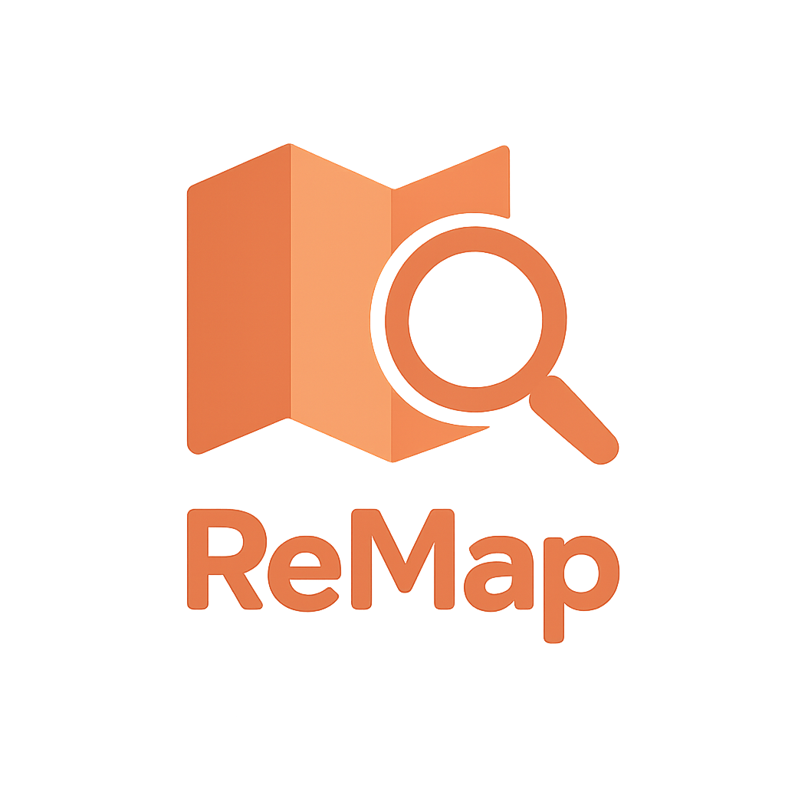

# ReMap 🗺️🔍

ReMap (Route Event Map) is a powerful platform that helps users discover relevant events along custom travel routes by combining semantic similarity search with dynamic geospatial and temporal filtering. Events are visualized on an interactive map powered by OpenStreetMap, providing a rich and seamless user experience.

Currently, ReMap uses synthetically generated event data for demonstration and testing purposes. Developing a dedicated platform for ingesting, managing, and utilizing real-world event data is planned as a crucial next step to expand the platform’s practical usage and customization.

---

## ▶️ Watch the Demo

[https://github.com/user-attachments/assets/ad2392c9-855b-4d18-b539-81ab7e23e460](https://github.com/user-attachments/assets/ad2392c9-855b-4d18-b539-81ab7e23e460)

---

## ✨ Features

- Store detailed event metadata including title, description, venue, address, latitude, and longitude.
- Perform advanced semantic search using sparse and dense embeddings of event descriptions stored in the powerful Qdrant vector database.
- Combine search with robust geospatial filtering within buffer zones along routes and temporal filtering by travel windows.
- Support multiple transport profiles (driving, cycling, walking) with routing via OpenRouteService API.
- Limit the number of returned events for tailored results.
- Interactive frontend built with Streamlit and OpenStreetMap for route visualization, buffered search areas, event markers, and detailed information panels.
- Input validation to ensure consistent date/time windows and query parameters.

---

## 🛠️ Technology Highlights

At the core of ReMap is **Qdrant**, a cutting-edge vector database designed for scalable, high-performance similarity search with integrated geospatial and temporal payload filtering. Leveraging Qdrant’s hybrid search capabilities, ReMap indexes both sparse and dense embeddings to provide accurate, context-aware event recommendations aligned with user travel routes.

To enhance user experience and input flexibility, ReMap employs **CrewAI** combined with the **Mistral large language model (LLM)** for sophisticated natural language understanding. This setup enables users to describe their travel plans and search queries naturally, which are then precisely parsed into structured query parameters executed efficiently by the backend. This natural language integration bridges the gap between human intent and technical search operations, making ReMap intuitive and powerful.

---

## ⚙️ How It Works

1. User provides origin, destination, travel buffer, transport mode, text query, travel time window, and number of desired event results.
2. Backend generates an optimized travel route and constructs a buffered polygon around it.
3. Qdrant executes a hybrid semantic similarity search combined with geo-filtering and temporal constraints.
4. Frontend displays the route, buffered search area, and relevant events interactively on an OpenStreetMap base.
5. Event details are accessible through map popups and a detailed event list.
6. Invalid input cases are gracefully handled and communicated.

---

## 🧰 Technology Stack

- [Qdrant](https://qdrant.tech/) vector database for semantic search and multi-dimensional filtering.
- Sparse and dense embedding models for rich semantic representation of event descriptions.
- Natural language input parsing powered by [crewai](https://www.crewai.com/) and [Mistral](https://mistral.ai/) as LLM.
- [OpenRouteService](https://openrouteservice.org/) for route computation supporting various travel profiles.
- Streamlit frontend with [OpenStreetMap](https://www.openstreetmap.org/) for map visualization.
- FastAPI backend serving APIs with complex routing and spatial operations using Geopandas and Shapely.
- Docker for containerized deployment ensuring portability and easy setup.

---

## 📦 Installation & Usage

For detailed installation instructions and user guidance, see the [User Guide](./docs/USER_GUIDE.md).

For system architecture, backend design, and API endpoint details, refer to the [Architecture & API Reference](./docs/ARCHITECTURE_API.md).

---

## ⚠️ Disclaimer

This project is an independent, open-source effort and is not affiliated with any other applications, websites, or organizations that may share similar names or concepts. Its purpose is to explore and demonstrate advanced event discovery along routes using technologies such as the Qdrant vector database, CrewAI, and Mistral LLM. It is not currently a commercial product or service.

The events are fictional and generated through a random process. They are located in the Veneto region, which is in northeastern Italy along the Adriatic Sea. The events are limited to the period from September 1, 2025, to September 30, 2025, solely for testing purposes.

Any liability related to the accuracy or authenticity of the events is disclaimed; these are not real or verified events.

---

## 🚀 Next Steps & Future Work

To expand ReMap’s scope and real-world applicability, a key future development is creating a dedicated platform for ingesting and managing authentic event data on a global scale. This includes:

- Building a scalable ingestion pipeline to insert real events into the system via APIs, user submissions, or automated data feeds.  
- Implementing web scraping and integration with popular event platforms worldwide to fetch live event data continuously.  
- Enhancing backend capabilities to handle diverse data formats and ensure data quality and consistency.  
- Introducing robust monitoring of retrieval quality, including evaluation of parameters such as `score_threshold` and Reciprocal Rank Fusion (RRF), to continuously optimize search relevance and result accuracy.  
- Transitioning from the current Streamlit frontend to a production-ready user interface with enhanced performance, responsiveness, and user experience suitable for real-world deployment.

These steps will transform ReMap into a comprehensive, real-time event discovery platform, offering reliable and scalable solutions to meet diverse user needs worldwide.

---

## 📄 License

This project is licensed under the MIT License.

---

## 📬 Contact

Questions or feedback? Please open an issue on the GitHub repository.

---

Discover events like never before — happy exploring with ReMap! 🗺️🔍
