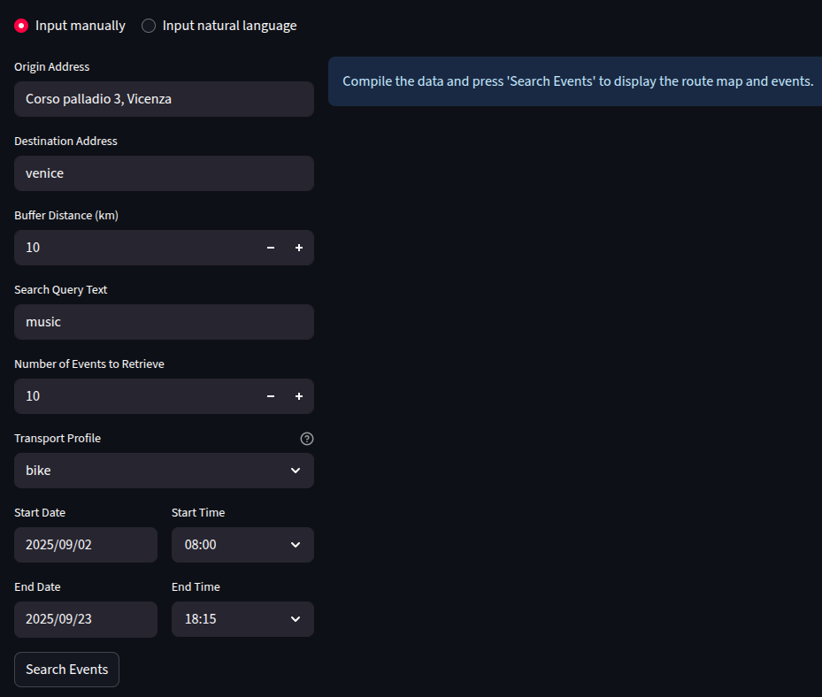
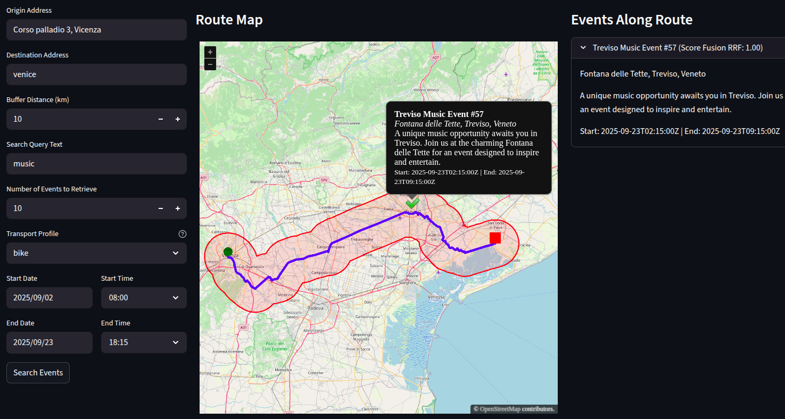
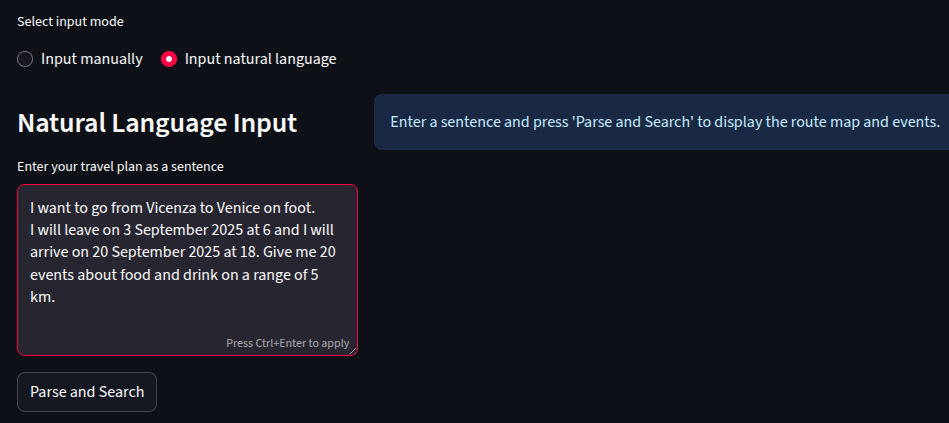
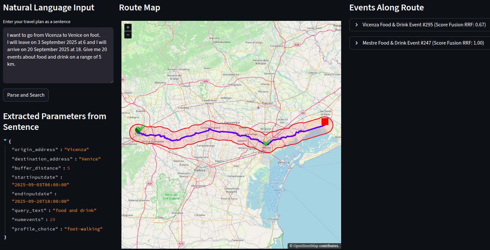

# User Guide

## Introduction

Welcome to the **ReMap** project! This application allows you to visualize events along a route using a combined backend and frontend system. The backend provides API services, and the frontend offers an interactive UI built with Streamlit.

## System Requirements

- Docker and Docker Compose installed (for easy deployment)
- Python 3.13+ if running locally without Docker
- Required API keys and configured endpoints as environment variables (see below)

## Required API Keys and Service Endpoints

To run **ReMap** successfully, the following API keys and endpoints must be configured as environment variables:

- **Qdrant Vector Database:**  
  - `QDRANT_SERVER`: The URL of the Qdrant server (can be self-hosted or cloud-based)  
  - `QDRANT_API_KEY`: API key for authenticating with Qdrant

- **OpenRouteService API:**  
  - `OPENROUTE_API_KEY`: Key for accessing OpenRouteService APIs used for geocoding and routing

- **OpenAI-Compatible LLM (Mistral via CrewAI):**  
  - `OPENAI_API_KEY`: API key for the large language model service  
  - `OPEN_AI_BASE_URL`: Base URL endpoint for the LLM (can be public OpenAI or a private deployment)  
  - `OPENAI_MODEL`: Model name used for natural language parsing

Ensure these keys are securely stored and accessible to both backend and frontend services during deployment.

## Installation and Setup

### Clone Repository (for all setups)

1. Clone the repository:

    ```
    git clone <repo-url>
    cd <repo-folder>
    ```

---

### Docker Setup

1. Build and run all services:

    ```
    docker compose up --build
    ```

---

### Local Setup

1. Create and activate a Python virtual environment.

2. Install backend dependencies:

    ```
    pip install -r backend/requirements.txt
    ```

3. Install frontend dependencies:

    ```
    pip install -r frontend/requirements.txt
    ```

4. Start services separately from their folders:

    - Backend (from `remap/backend`):

      ```
      uvicorn app.main:app --reload
      ```

    - Frontend (from `remap/frontend`):

      ```
      streamlit run streamlit_app.py
      ```

---

### Accessing the Application

- Access the frontend UI at: [http://localhost:8501](http://localhost:8501)  


- Access the backend API documentation at: [http://localhost:8000/docs](http://localhost:8000/docs)  


---

## Getting Started

### User Interface Overview

- Input addresses and travel profile manually or input natural language travel plans.
#### Manual input




- Specify buffer distance, date ranges, and query text to filter events.

- Events are displayed interactively on the map along the travel route.




 #### Natural Language Input

   

  - Specify buffer distance, date ranges, and query text as natural language sentence


  


## Core Features Usage

### Creating an Event Map

1. Enter origin and destination addresses or write a natural language sentence describing your route.
2. Set buffer radius (in km) to specify the event search area.
3. Choose transport profile (car, bike, walking).
4. Set date and time ranges to filter event schedules.
5. Submit and explore generated events on the interactive map.

### Natural Language Query

Use the frontend's natural language input mode to describe travel plans naturally, like:

> "I want to go from Vicenza to Trento leaving 2 September 2025 at 2 a.m., arriving 18 October 2025 at 5 a.m., and show me 10 music events within 6 km using bike."

### Uploading and Managing Event Data

All event datasets are maintained in the `dataset/` directory and initially prepared using the Jupyter notebooks located in the `notebooks/` folder. To add new events, create JSON files that adhere to the structure defined in the provided template: `dataset/veneto_events_template.json`. 

These JSON files can then be uploaded to the system via the backend `/ingestevents` API endpoint. Upon upload, events are processed and indexed in the Qdrant vector database, enabling efficient and fast retrieval during route-based searches and queries.

## Troubleshooting

- Ensure Docker is running and ports 8000 and 8501 are free.
- Verify that required API keys and endpoints are properly configured in your environment.
- Check backend logs for errors during event ingestion or route creation.
- Clear browser cache if frontend UI behaves unexpectedly.

## FAQs

**Q:** Can I use the backend API independently?  
**A:** Yes, the API is fully accessible via HTTP endpoints documented and available at `/docs` on the backend server (e.g., `http://localhost:8000/docs`).


## Contact and Support

For issues or questions, please open an issue on the GitHub repository.

---

Thank you for using **ReMap**!  
Happy mapping and discovery!
